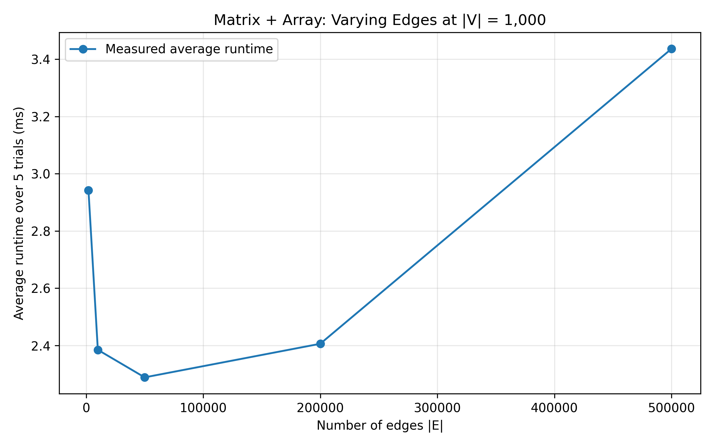
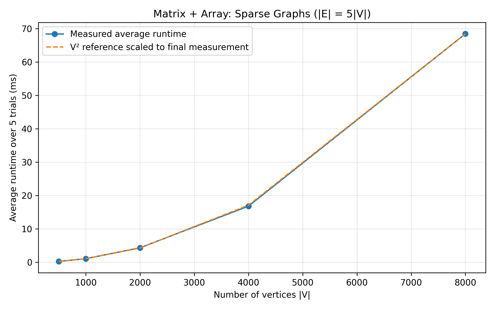
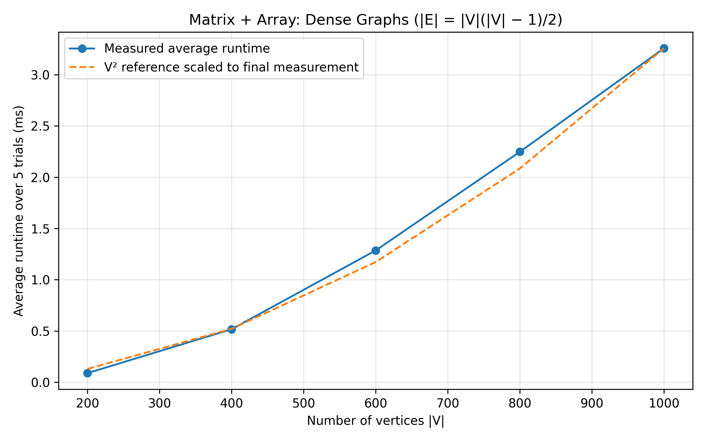

# Part (a): Dijkstra Using an Adjacency Matrix and Array

## Implementation

The graph is stored in an adjacency matrix, where matrix[u][v]
contains the weight of the directed edge from u to v.
A value of -1 indicates that no edge exists.

The dist array stores tentative shortest distances.
The visited array identifies vertices whose distances have
been finalised.

In each iteration, the algorithm scans the dist array to select
the unvisited vertex with the smallest distance. It then scans
that vertex's matrix row and relaxes its outgoing edges.

The implementation requires non-negative edge weights.

## Theoretical Time Complexity

Let V be the number of vertices and E the number of edges.

- Initialising dist and visited takes O(V).
- Selecting the minimum-distance vertex takes O(V) per iteration.
- Scanning its adjacency-matrix row takes O(V) per iteration.
- There are at most V iterations.

Therefore, the worst-case time complexity is O(V²).
For graphs where all vertices are reachable from the source,
the implementation takes Θ(V²).

Even for sparse graphs, the algorithm scans full matrix rows
rather than only existing edges. Reducing E therefore does
not remove the quadratic scanning cost.

The adjacency matrix requires Θ(V²) space. The additional
dist and visited arrays require Θ(V) space.

## Experimental Method

The implementation was compiled using:

g++ -std=c++17 -O2 benchmark_matrix.cpp -o benchmark_matrix

All graphs were directed, and vertex 0 was the source.
Each dataset was tested five times, and the mean elapsed
runtime was recorded using std::chrono::steady_clock.

Timing included the Dijkstra call and its working-array
initialisation, but excluded dataset loading, matrix
construction, result processing, and printing.

Three experiments were conducted:
1. Fixed V = 1,000, with varying E.
2. Sparse graphs with E = 5V, with varying V.
3. Dense graphs with E = V(V - 1)/2, with varying V.

## Empirical Results

### Fixed Vertex Count, Varying Edge Count

With V fixed at 1,000, runtime ranged from approximately
2.29 to 3.44 ms as E increased from 2,000 to 500,000.

Runtime did not increase proportionally to E. This is consistent
with the matrix and array implementation, whose main scanning
cost depends on V². Edge density affects the work performed
within those scans, while measurement variation can also
affect the recorded times.

### Sparse Graphs, Varying Vertex Count

Doubling V approximately quadrupled runtime.
For example, runtime increased from 4.343050 ms at V = 2,000
to 16.821333 ms at V = 4,000, and then to 68.439792 ms
at V = 8,000.

This closely follows quadratic growth, despite E growing
only linearly as E = 5V.

### Dense Graphs, Varying Vertex Count

Runtime increased from 0.088842 ms at V = 200 to
3.257592 ms at V = 1,000.

The measurements broadly followed the scaled V² reference,
with deviations at individual input sizes.

The reference curves are scaled to the final measured point
for visual comparison. Their agreement at that point is
therefore intentional.

## Correctness Check

The matrix-and-array implementation was compared with the
adjacency-list-and-heap implementation on all 15 datasets,
using vertex 0 as the source. Every vertex's shortest distance
matched in every dataset.

## Conclusion

The experimental results support the theoretical Θ(V²)
runtime for these source-reachable graphs. Vertex count
has a strong effect on runtime, while changing edge count
at a fixed vertex count has a smaller effect.

These measurements use one generated graph per setting,
with five repeated runs of that graph. They support the
observed trend but do not capture variation across multiple
random graphs.